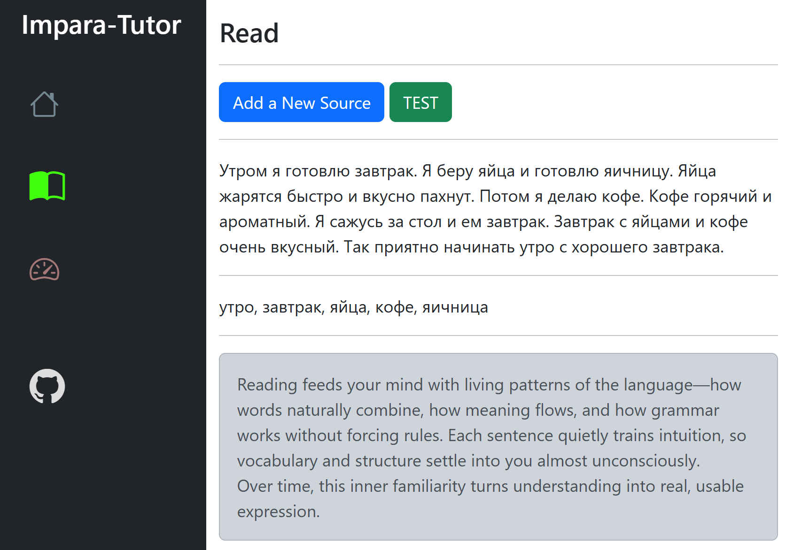

# Impara-Tutor
## AI Driven Language Learning Software

- Impara (from Latin imparare, meaning "to learn together" or "to teach jointly")
- Tutor (from Latin tutor, meaning "protector" or "guardian" — derived from tutus, "safe/protected")

The proof of concept works. It asked Ollama to return a comma separated list of the most important words from the given text.

